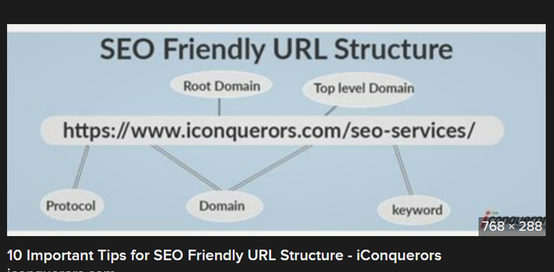
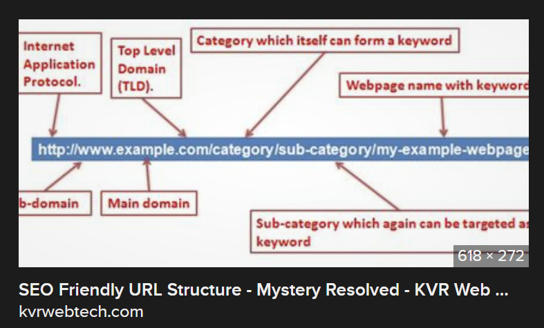

# springDemo2URLShortener

microservices-and-restful-services-with-spring-boot

# springDemo2URLShortener

SEO friendly URLs are URLs that are designed to meet the needs of users and searchers. Specifically, URLs optimized for SEO tend to be short and keyword-rich. Why are URLs important for SEO? Along with your title tag, link anchor text, and the content itself, search engines use your webpage's URL to understand what your content is all about.  

[SEO friendly URLs](https://backlinko.com/hub/seo/urls 'SEO Friendly URLs')

 
 

### New Requirement

Web API

* that creates a "short code" for a given long-form URL .
* that, given a short code, returns an HTTP 302 that redirects to the long URL
* URL short codes must be unique
* URL short codes must be as short as possible
* use any database to store the mapping from long URL to short code

Constraints

* assume that the database is unreliable and sometimes just fails (you can simulate this by throwing an exception with a 10% probability in every database call)

* assume that the API to create a short code is called only sporadically
* assume that the API that returns a redirect for a given short code is called many(!) times per second
* assume that there is a high SLO (Service Level Objectives) on the reliability of the redirect API (even though the database is unreliable), i.e. it should only return an error if nothing else is possible
  
  
  

